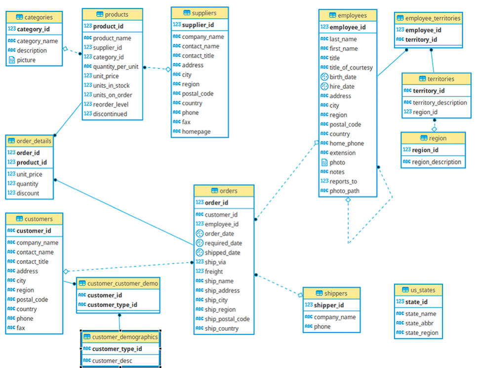

# Northwind Database Analysis 🔍
## Objective
This project aims to show some basic and advanced SQL functions, using Northwind database. Through analysis like the one showed here, companies will be able to get some valuables insights, that will help to take better decisions.

Functions like `SELECT`, `JOIN`, `GROUP BY`, `COUNT`, `DISTINCT`, `HAVING`, and  application of some concepts about `WINDOW FUNCTION` will be addressed.

## Setup
### Docker 🐳
If you are a Docker user, you are able to have all the project configured only by running the docker compose command:
```
docker-compose up -d
```
Wait for all containers beign created, and then you can access the database using PgAdmin following the URL: http://localhost:5050 with the password _`postgres`_.

Configure a new server on PgAdmin:
```
** General **:
    * Name: db
** Connection **:
    * Hostname: db
    * Username: postgres
    * Password: postgres    
```


## About Northwind Database
Northwind database is a sample database commonly used for learning and demonstrations purposes. It simulares a small business that imports and exports specialty foods, providing realistic data about products, customers, orders, employees, suppliers and more.

### Northwind Diagram
The diagram below shows the main Northwind database entities, offering a fast comprehension about the model.

- _**orders:**_ Customers generating orders
- _**order_detail:**_ Products that are on the orders.
- _**products:**_ Products and their details, as unity price, units in stock, discontinued, etc.


